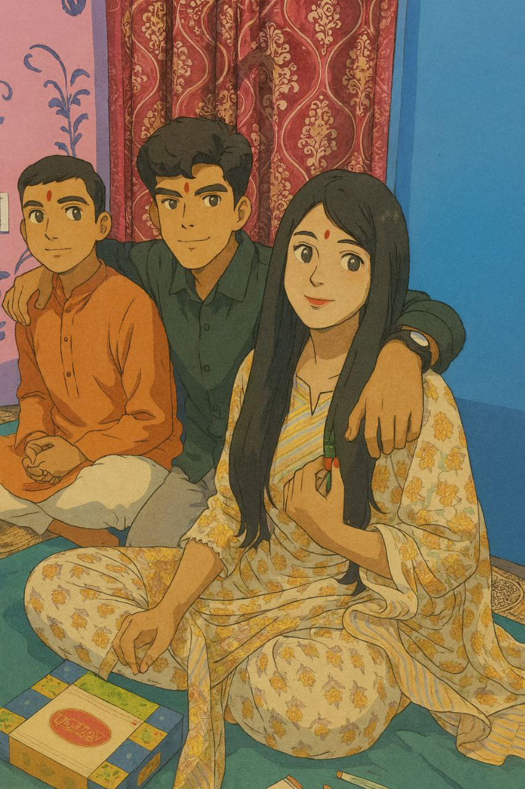
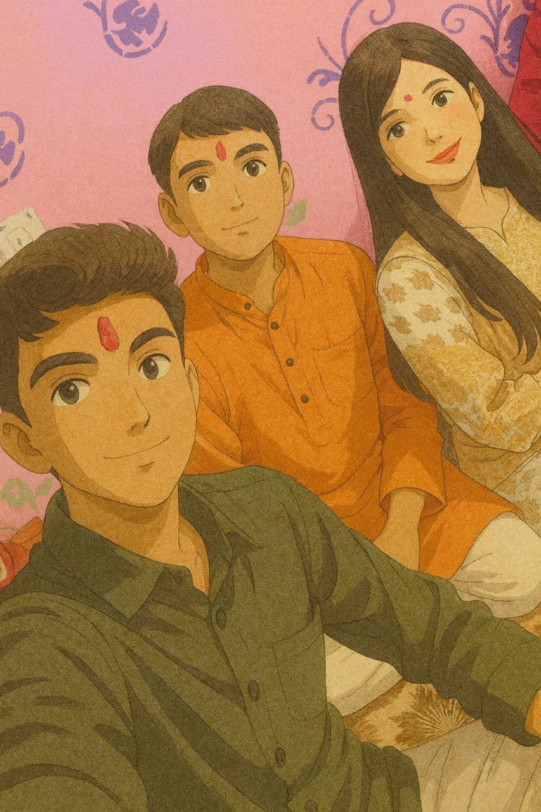
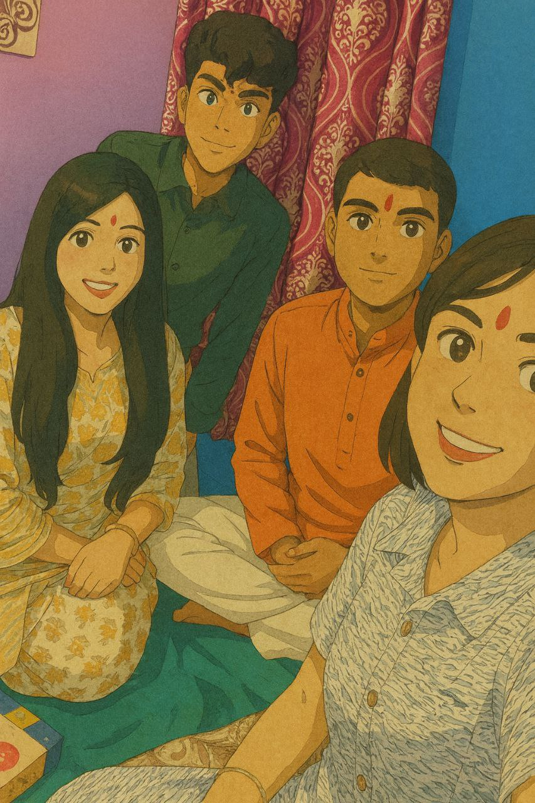
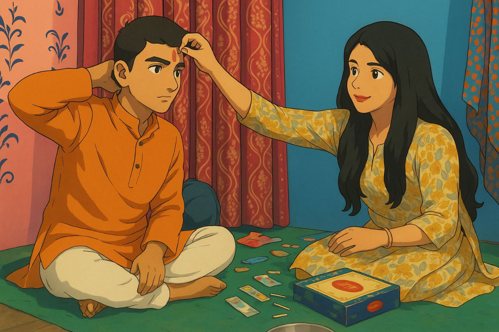
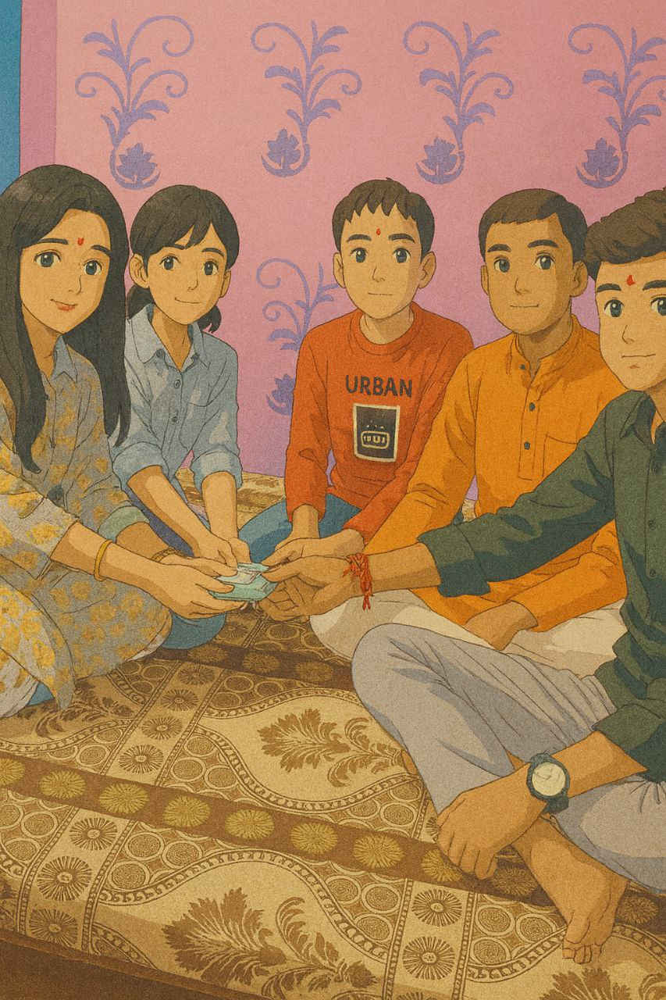
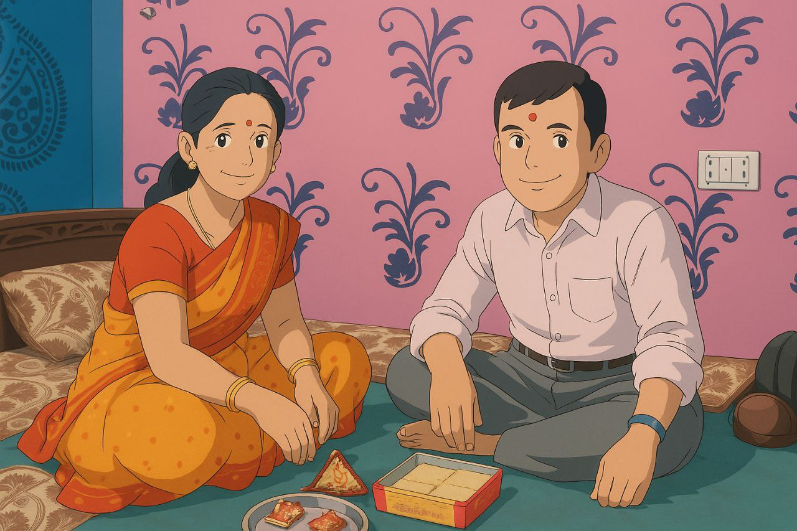

<!-- Cover Banner -->
<p align="center">
  
</p>

<h1 align="center">🎀 Rakhi — Interactive Web Card</h1>

<p align="center">
  Tap-and-hold unlock, rakhi-tying SVG animation, fireworks, confetti, petals, music & a smooth memories slider (mem1–mem6).  
  <br />
  <a href="https://rakhi-sigma.vercel.app" target="_blank"><strong>🌐 View Live Demo →</strong></a>
</p>

<p align="center">
  
  
  
  
  
</p>

---

## 📋 Table of Contents
- [🧾 About](#-about)
- [✨ Features](#-features)
- [📂 Project Structure](#-project-structure)
- [🖼️ Screenshots](#-screenshots)
- [🛠️ Tech Stack](#-tech-stack)
- [🔧 Local Setup](#-local-setup)
- [🚀 Deploy](#-deploy)
- [🎛️ Customization](#-customization)
- [📲 Share Snippet](#-share-snippet)
- [👨‍💻 Developer](#-developer)
- [📄 License](#-license)

---

## 🧾 About
**Mobile pe best result aata hai.**  
Laptop/Desktop par bhi accha lagega — bas images ka sahi size/ratio use karo (see customization section).

---

## ✨ Features
- 🔒 Tap & Hold (2s) unlock screen
- 🧵 SVG rakhi-tying micro-animation over hero photo (auto-play & fade)
- ⌨️ Typewriter wish text
- 🎉 Confetti + Fireworks (canvas) & falling petals
- 🎵 Background music with Play/Pause
- 🖼️ Memories slider (mem1…mem6) with dots
- 📤 Share (Web Share API + clipboard fallback)
- 🎚️ Subtle tilt & rotating rakhi frame
- 🧩 Pure HTML/CSS/JS – no build tools

---

## 📂 Project Structure
```Rakhi/
├─ index.html
├─ favicon.png
├─ song.mp3
└─ images/
├─ sister.jpg # hero (square)
├─ mem1.jpg
├─ mem2.jpg
├─ mem3.jpg
├─ mem4.jpg
├─ mem5.jpg
└─ mem6.jpg
```

---

## 🖼️ Screenshots

| Hero (cover)                                 | Memory 1                                   | Memory 2                                   |
| -------------------------------------------- | ------------------------------------------ | ------------------------------------------ |
|  |  |  |

| Memory 3                                   | Memory 4                                   | Memory 5/6                                                                            |
| ------------------------------------------ | ------------------------------------------ | ------------------------------------------------------------------------------------- |
|  |  |   |

---

## 🛠️ Tech Stack
| Layer   | Tools                                   |
| ------- | --------------------------------------- |
| Core    | HTML5, CSS3, Vanilla JS                 |
| Effects | Canvas (fireworks), `js-confetti` (CDN) |
| Media   | Audio (`song.mp3`), local images        |
| Hosting | GitHub Pages (static)                   |

---

## 🔧 Local Setup
```bash
# clone
git clone https://github.com/CodeByDhiraj/Rakhi.git
cd Rakhi

# run a local server (choose one)
python -m http.server 8000
# or
npx http-server -p 8000

# open in browser
http://localhost:8000
```

🚀 Deploy (GitHub Pages)
Push code to main branch.
Go to GitHub → Settings → Pages
Source: Deploy from a branch → Branch: main, Folder: /
Save. Wait 1–2 minutes.
Live at: https://codebydhiraj.github.io/Rakhi

📲 Share Snippet
``` WhatsApp / Telegram text:
Rakhi surprise for you 💝
Tap & hold for 2 sec!
https://rakhi-sigma.vercel.app
```

Developer
Made with ❤️ by Dhiraj Kumar (@CodeByDhiraj)

📄 License
This project is licensed under the MIT License — feel free to use/share with credit.


